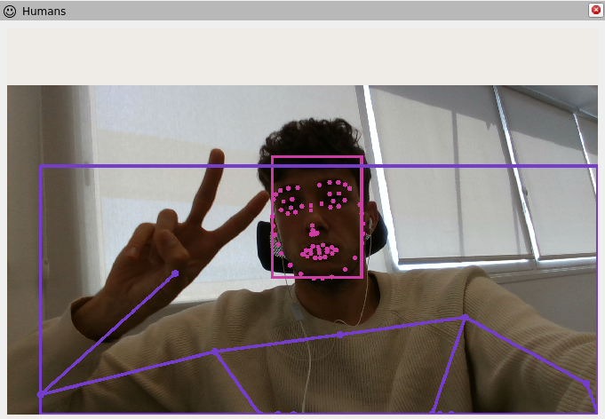

hri_rviz
========

This package provides a list of `rviz2` plugins for human-related
data visualisation. It is part of the `ROS4HRI` ecosystem.

Plugins
-------

### Humans

A plugin for visualising 2D information overlayed on a camera stream
(ideally, the stream used to detect it). Currently, the plugin can visualise:
- Face bounding boxes
- Face landmarks
- Body bounding boxes
- 2D skeleton keypoints

#### How to use it

0. If not already available, add a `Displays panel`;
1. press the `Add` button at the bottom to istantiate a new plugin;
2. select `By topic`;
3. among the available topics, select the `Humans` plugin for the
   camera stream you are interested in;
4. once created the plugin, select which type of information
   you want to visualise (face bounging boxes, skeleton landmarks, etc.);
5. enjoy!

### Skeletons3D

A plugin for visualising the estimated 3D poses of the detected humans.

#### How to use it

0. If not already available, add a `Displays panel`;
1. press the `Add` button at the bottom to istantiate a new plugin;
2. select `By display type`;
3. select `Skeletons3D`;
4. enjoy!

### TF_HRI

A plugin for visualising the human-related TF frames. These are higly dynamical,
appearing and disappearing in a matter of seconds. Using the classic `TF` plugin
would result in a crowded and chaotic frames visualisation. This plugin:
- looks over the detected faces and bodies;
- only displays the face and bodies TF frames for the currently detected
  bodies and faces;
- readily remove the TF frames for those bodies and faces that are no more
  tracked, avoiding the disappearing phase observed in the original TF frame
  for the non-updated frames.
It is possible to select which human frames to visualise among:
- face frames;
- gaze frames;
- body frames;

#### How to use it

0. If not already available, add a `Displays panel`;
1. press the `Add` button at the bottom to istantiate a new plugin;
2. select `By display type`;
3. select `TF_HRI`;
4. enjoy!

Test
----

To test the `hri_rviz` plugins:
1. Download [`hri_face_detect`](https://gitlab/ros4hri/hri_face_detect) and
   [`hri_fullbody`](https://gitlab/ros4hri/hri_fullbody);
2. build them;
3. start an RGB camera stream;
4. start face and body detection:
	- `ros2 launch hri_face_detect face_detect.launch.py filtering_frame:=<camera_frame> rgb_camera:=<rgb_camera_stream_ns>`
	- `ros2 launch hri_fullbody hri_fullbody.launch.py rgb_camera:=<rgb_camera_stream_ns>`
   	where `<rgb_camera_stream_ns>` is the RGB camera stream namespace (e.g., `/camera/color`). This expects the raw RGB images
   	to be published on `<rgb_camera_stream_ns>/image_raw`. Check the `launch` files parameters for different options.
5. start the plugins as previously described.
